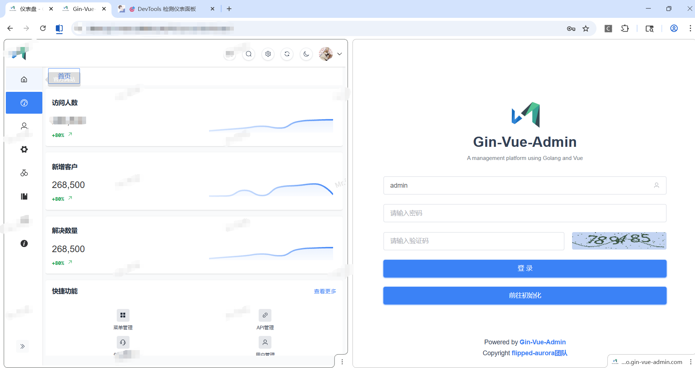
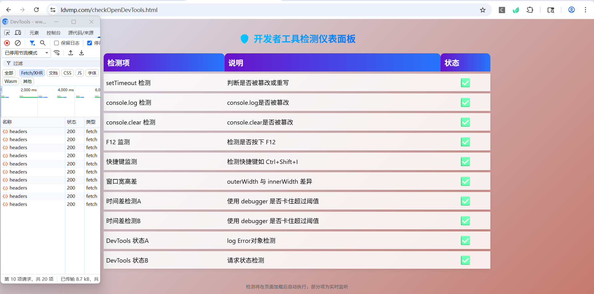
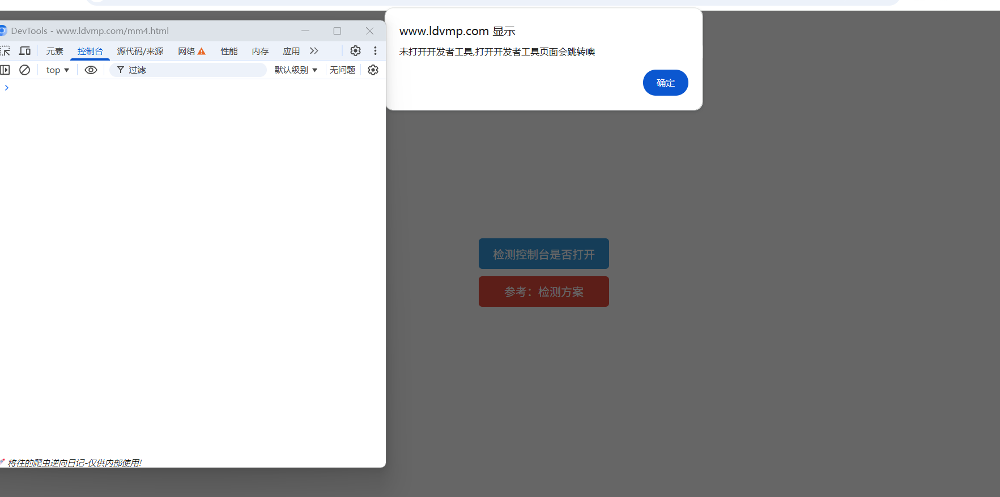
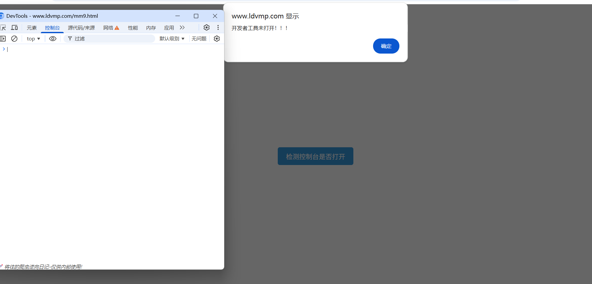
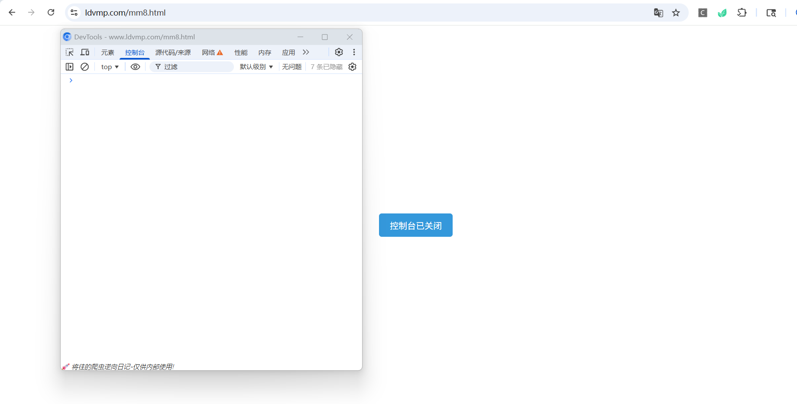

# 基于电力交易业务定制 Chromium 浏览器

## 📋 项目简介

基于电力交易业务场景定制的 Chromium 浏览器，融合了业务功能与开发工具特性，提供安全、高效、稳定的浏览体验。

---

## 🎯 核心功能

### 🏢 业务场景功能

#### 账号隔离管理
- ✅ **标签页独立 Cookies**：不同标签页拥有独立的 Cookie 环境
- ✅ **多账号共存**：配合自动登录插件，实现完美便捷的账号切换
- ✅ **隔离演示**：支持多账号同时在线操作

  

#### 安全与稳定性
- ✅ **最新内核**：采用 Chromium 144 最新内核，增强安全性
- ✅ **启动鉴权**：加密启动鉴权机制，支持自定义配置使用时间

### 👨‍💻 开发场景功能

#### 反检测能力
- ✅ **开发者工具检测**：完美过掉 ldvmp 的开发者工具检测
  - 检测站点：`https://www.ldvmp.com/`
  
  
  
  
  

#### 调试增强
- ✅ **调试保护**：删除 debugger 关键字
- ✅ **新增关键字**：增加 debugering 关键字
- ✅ **日志保存**：默认保存 console 日志为 chromium 目录下的 hooklog.txt

---

## 📅 开发计划

### 近期计划
#### 业务支持
- ⏳ **HTTP 账号密码代理**
- ⏳ **WebSocket 转发**
- ⏳ **Cookies 明文存储**
#### 开发支持
- ⏳ **Console 保存配置**

### 未来计划
- 🔮 **单 Tab 页指纹配置**
- 🔮 **单 Tab 页代理配置**
---

## 🚀 技术优势

- **性能优异**：基于最新 Chromium 内核，运行流畅
- **稳定运行**：强大的反检测能力，确保业务稳定开展

---

## 💡 应用场景

- **电力交易自动化**：配合脚本实现自动化交易操作
- **多账号管理**：同时登录多个账号，高效切换操作
- **安全访问**：保护账号信息，防止关联检测
- **开发调试**：安全稳定的开发环境，避免检测干扰

`链接: https://pan.baidu.com/s/18O8QSzI8iYquzBiE1VFG1w?pwd=jwcz`

使用建议：增加--user-data-dir="C:\chromium" 参数避免环境污染

